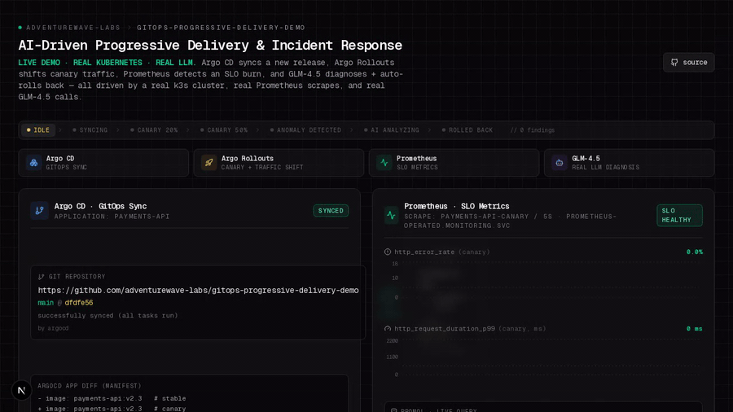
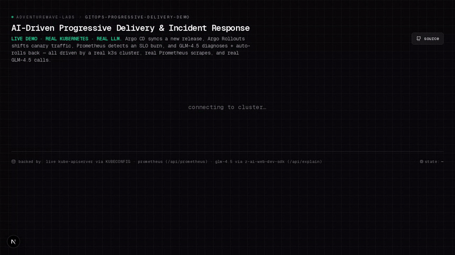
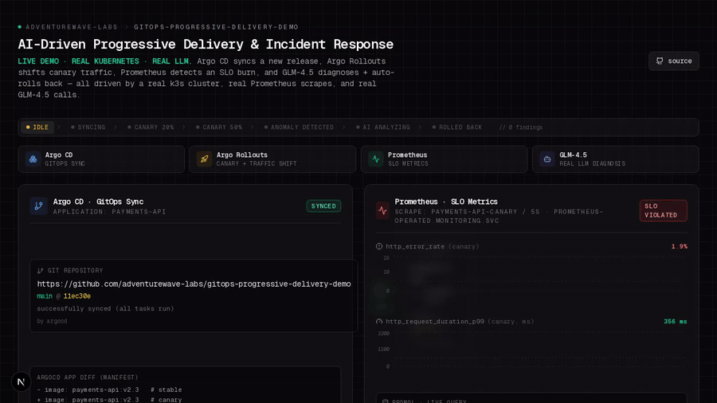

<p align="center"></p>

# gitops-progressive-delivery-demo

A GitOps progressive-delivery pipeline that actually runs: real k3s, real Argo CD,
real Argo Rollouts, real Prometheus, and a real LLM call for the root-cause write-up.
A deliberately broken canary gets promoted, breaches its SLO, and is rolled back by
the Argo Rollouts controller — no scripted state machine, no fixture data. Every
number on the dashboard is read back out of the cluster at request time.


**[Watch it run →](https://adventurewave-labs.github.io/gitops-progressive-delivery-demo/)**
&nbsp;·&nbsp;
[](https://codespaces.new/adventurewave-labs/gitops-progressive-delivery-demo?quickstart=1)

---

## What it looks like

Argo CD sync → canary 20% → canary 50%, with Prometheus tripping the
error-rate SLO on the way:



The analyzer running against the live cluster: seven analyzers, one real
finding, routed to GLM-4.5. The `/api/explain` call errors here because the
recording box had no `ZAI_API_KEY` — with one set, the diagnosis renders in
that same panel:



The abort: canary image reverted to v2.3 and Argo CD re-syncing:



These are screen recordings of the running system, captured by
`scripts/record-gifs.sh` driving the live dashboard with Playwright. Nothing in
them is staged — the recorder refuses to write a clip in which the dashboard
never left a single phase, so a still screen can't be passed off as a pipeline.

---

## What's real

| Component | What it actually does |
|-----------|----------------------|
| **k3s cluster** | Single-node Kubernetes in Docker (k3d). Real kube-apiserver, scheduler, kubelet. |
| **Argo CD** | Real Argo CD (Helm) watching `manifests-repo/`. `selfHeal` is off so the demo controller can drive the canary imperatively. |
| **Argo Rollouts** | Real Rollout CRD, real canary steps (20% → pause → 50% → Analysis → 100%). The controller does the scaling, weighting and aborting. |
| **Prometheus** | kube-prometheus-stack scraping both Services every 5s through a ServiceMonitor. Real PromQL. |
| **payments-api:v2.3** | Go HTTP server, stdlib only, exposing real Prometheus text-format metrics including a cumulative latency histogram. |
| **payments-api:v2.4** | Same server plus a goroutine leaking 10MB every 5s. Against the `128Mi` limit the kernel OOMKills it in roughly a minute. |
| **Cluster analyzer** | `/api/analyze` runs 5 rule-based analyzers (Pod, Deployment, Rollout, PVC, Node) over live cluster state. No LLM at this stage. |
| **GLM-4.5** | `/api/explain` makes a real network call to Z.AI, grounded only in the analyzer's findings. |
| **Dashboard** | Polls `/api/cluster-state`, which derives everything from live Rollout status, live pod specs and live Prometheus queries. |

---

## Run it

### Codespaces

[](https://codespaces.new/adventurewave-labs/gitops-progressive-delivery-demo?quickstart=1)

The devcontainer gives you Docker-in-Docker, Node 22, kubectl, Helm and bun. It does
**not** bootstrap the cluster for you — that is the first command below.

You need the 4-core / 16GB machine type. On 2 cores the cluster comes up but
Playwright recording will not.

### Either way, three terminals

```bash
# 1. Bootstrap: k3d cluster, Argo CD, Argo Rollouts, Prometheus,
#    build both Go images, apply the manifests. Idempotent.
bash setup.sh          # or: bun run setup

# 2. Dashboard against the real cluster
bash dev-real.sh       # or: bun run dev:real

# 3. Demo controller — promotes the canary, waits for the abort, rolls back, repeats
bash demo-controller/cycle.sh    # or: bun run demo
```

Then open <http://localhost:3000>. One cycle takes about 3–4 minutes and ends with
`CYCLE COMPLETE` in terminal 3.

`/api/explain` needs a `ZAI_API_KEY` (see `.env.example`). Without one, every other
panel still works and the LLM card surfaces the error instead of inventing a
diagnosis.

---

## How the canary actually breaks

`payments-app/canary/main.go`:

```go
func startMemoryLeak() {
    var leaked [][]byte
    ticker := time.NewTicker(5 * time.Second)
    for range ticker.C {
        chunk := make([]byte, 10*1024*1024) // 10MB
        for i := range chunk { chunk[i] = byte(i % 256) }
        leaked = append(leaked, chunk)
    }
}
```

`/healthz` deliberately keeps returning 200, so the container dies from the kernel's
OOM killer rather than a liveness restart.

Two independent things can then abort the rollout, and either is a legitimate
outcome:

- the canary pods get OOMKilled (exit 137) and stop serving, or
- the `canary-error-rate` metric crosses the 1% SLO and the AnalysisRun fails
  three times, past its `failureLimit` of 2.

Which one trips first depends on how fast the leak wins the race against the
analysis interval. The observed abort in the last verified run was the error-rate
path, with no OOMKill inside the 180s window. The demo does not pretend otherwise —
`cycle.sh` reports what actually happened.

### Where the "~20s" rollback figure comes from

`manifests-repo/analysis-template.yaml` samples Prometheus every
`interval: 10s`, with `failureLimit: 2` — Argo Rollouts marks the AnalysisRun
`Failed` on the *third* breach of a metric's `successCondition`, not the first.
Three samples 10s apart land at roughly t+0s, t+10s and t+20s after analysis
starts, so once `canary-error-rate` is already over the 1% SLO, the AnalysisRun
fails around the 20-second mark, and Argo Rollouts aborts the Rollout
(canary scaled to 0, traffic back on stable) as soon as it does. That's the
`~20s` in this repo's description.

That is the time from "AnalysisRun starts" to "abort," not from the very
start of the rollout — it excludes the earlier `pause: { duration: 15s }` at
20% weight in `manifests-repo/rollout.yaml`, which runs before the step-up to
50% and the AnalysisRun. It's also an observed order of magnitude rather than
a guaranteed bound: the 5s Prometheus scrape interval and how quickly the
goroutine leak actually pushes the error rate past 1% both shift it from run
to run — see `scripts/uat-test.sh` and the recorded `public/showcase/uat-results.json`
for what a given run actually measured.

---

## The pipeline

```
demo controller sets the canary image
      ↓
Argo Rollouts: 20% → pause 15s → 50% → AnalysisRun
      ↓
v2.4 leaks memory; Prometheus scrapes both Services every 5s
      ↓
AnalysisRun queries Prometheus: error rate > 1%  →  measurement Failed
      ↓
3 failures > failureLimit 2  →  controller aborts the Rollout
      ↓
canary scaled to 0, 100% of traffic back on stable
      ↓
dashboard reflects each transition from live API reads
```

## Architecture

```
k3d cluster
├── argocd/       Argo CD          → watches manifests-repo/
├── argo-rollouts/ Rollouts controller
├── monitoring/   kube-prometheus-stack
└── payment-prod/
    ├── Rollout payments-api (4 replicas, 128Mi limit)
    ├── Service payments-api-stable   ─┐
    ├── Service payments-api-canary   ─┤ ServiceMonitor scrapes both
    ├── AnalysisTemplate prometheus-slo
    └── Deployment payments-loadgen (drives traffic at both Services)

Next.js dashboard (:3000)
├── /api/cluster-state  live Rollout + pods + Prometheus  → the whole UI
├── /api/prometheus     PromQL proxy
├── /api/k8s/...        read-only kube-apiserver proxy (client-cert auth from kubeconfig)
├── /api/analyze        5 rule-based analyzers, no LLM
└── /api/explain        GLM-4.5, grounded in those findings
```

---

## Verification

```bash
bash scripts/uat-test.sh
```

17 checks against the running stack — k3d nodes, Argo CD sync state, Rollout phase
and stable hash, both Services, the AnalysisTemplate, the ServiceMonitor, Prometheus
targets and series, and all five app routes. It prints a pass/fail table, writes
`public/showcase/uat-results.json`, and exits non-zero if anything fails. The
showcase page renders that file, so it can never claim more than the last real run.

## Recording the GIFs

```bash
# with the cluster, dashboard and controller all running:
bash scripts/record-gifs.sh
```

Self-installs Playwright and ffmpeg into a gitignored `.playwright/`, waits for a
fresh cycle, records the live dashboard, and encodes to GIF.

## Tech stack

| Layer      | Choice |
|------------|--------|
| Cluster    | k3d / k3s |
| GitOps     | Argo CD (Helm) |
| Delivery   | Argo Rollouts |
| Monitoring | kube-prometheus-stack |
| App        | Go 1.22, stdlib only |
| Framework  | Next.js 16 (App Router) |
| LLM        | GLM-4.5 via `z-ai-web-dev-sdk` |

## License

[MIT](./LICENSE) — © 2026 adventurewave-labs and contributors.
